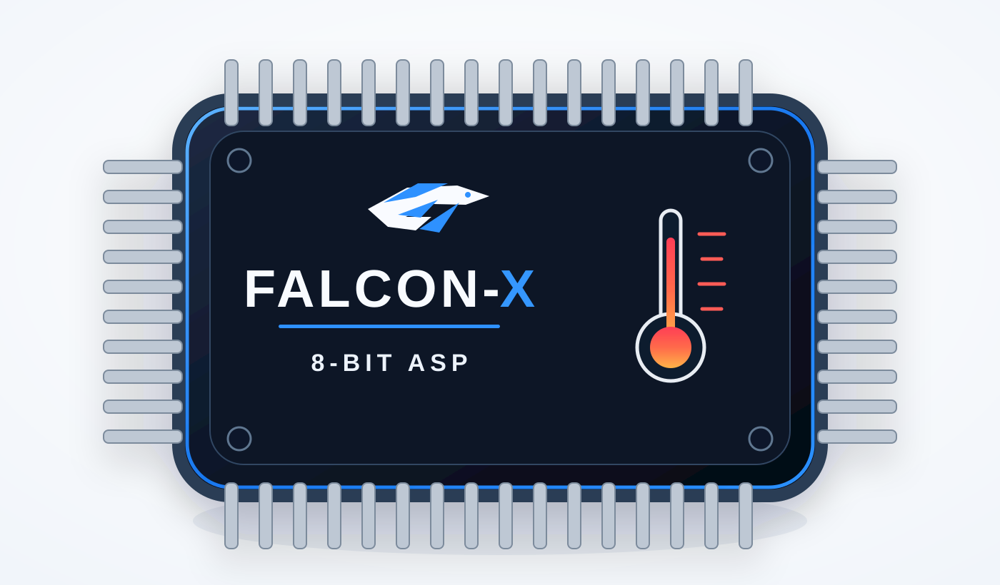
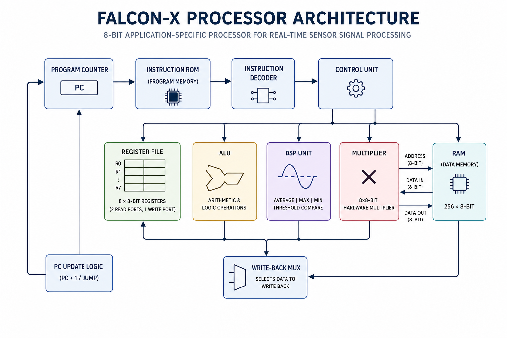
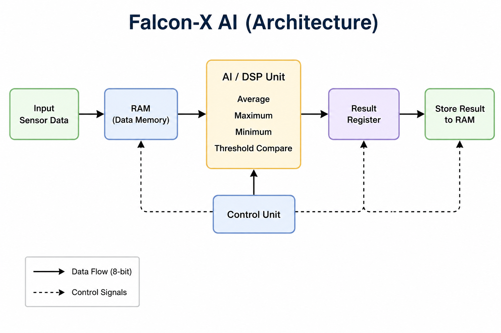
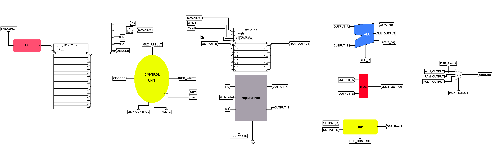
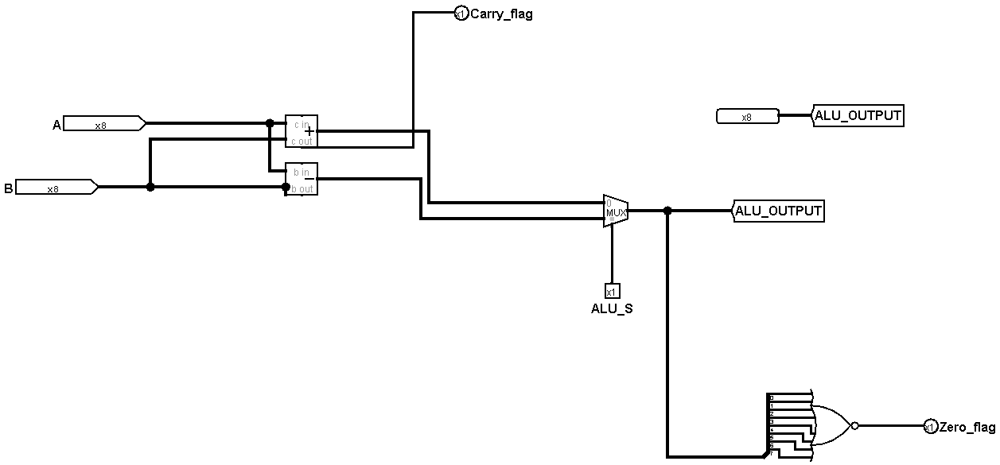
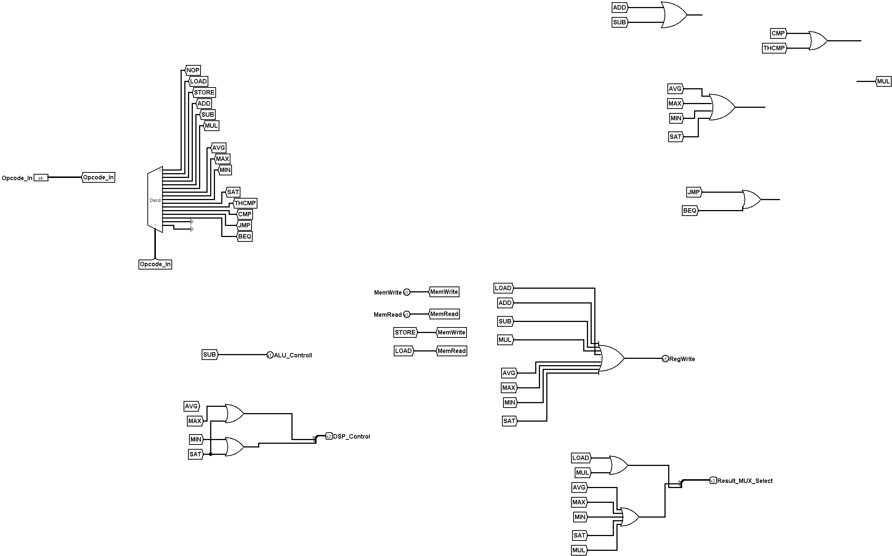
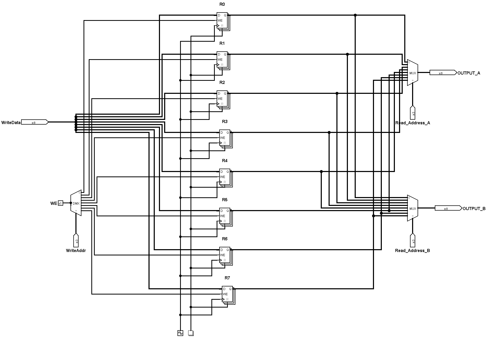
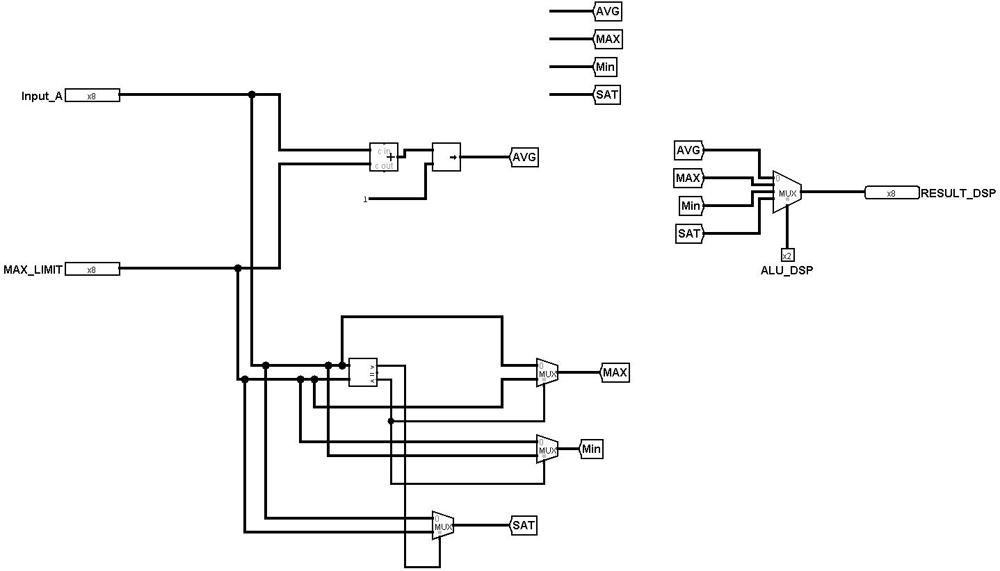
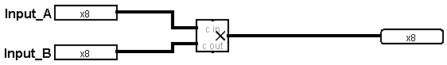
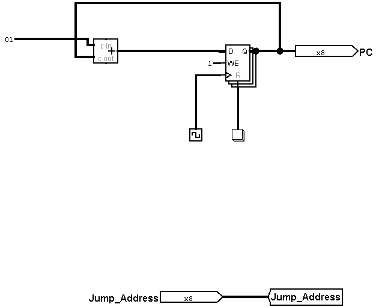

# Falcon-X Processor

<p align="center">
  
</p>

<p align="center">
  <strong>8-bit Application-Specific Processor for Real-Time Sensor Signal Processing</strong>
</p>

<p align="center">
  
  
  
  
</p>

## Overview

Falcon-X is an **8-bit Application-Specific Processor (ASP)** designed in **Logisim Evolution** for real-time sensor signal processing.

The processor combines a custom ISA, register-based datapath, control logic, RAM, ALU, hardware multiplier, and a dedicated DSP unit. Instead of behaving like a general-purpose CPU, Falcon-X is optimized around a specific embedded workload: reading sensor data, processing it, detecting relevant conditions, and storing the resulting values.

## Engineering Problem

Embedded monitoring systems repeatedly perform operations such as:

- Reading sensor values
- Calculating averages
- Finding maximum and minimum values
- Comparing measurements against thresholds
- Storing processed results

Implementing these operations entirely in software can increase instruction count and software complexity. Falcon-X explores the alternative of moving frequently used sensor-processing operations into dedicated hardware.

## Falcon-X Architecture

<p align="center">
  
</p>

The architecture integrates:

- Program Counter
- Instruction ROM
- Instruction Decoder / Control Logic
- Register File
- ALU
- DSP Unit
- Hardware Multiplier
- RAM
- Write-back and selection logic

## Processing Flow

<p align="center">
  
</p>

```text
Sensor Input
     │
     ▼
   RAM
     │
     ▼
Falcon-X Processor
 ┌───┼──────────────┐
 ▼   ▼              ▼
ALU DSP        Multiplier
 └───┼──────────────┘
     ▼
Result Register
     │
     ▼
    RAM
```

## Key Specifications

| Specification | Value |
|---|---|
| Data Width | 8-bit |
| Instruction Width | 16-bit |
| Processor Type | Application-Specific Processor |
| Implementation | Logisim Evolution |
| Register Architecture | Register-based |
| DSP Operations | AVG, MAX, MIN, SAT/Threshold comparison |
| Memory Interface | RAM with LOAD / STORE |

## Instruction Set

| Instruction | Category | Purpose |
|---|---|---|
| `LOAD` | Memory | Load data from RAM |
| `STORE` | Memory | Store data to RAM |
| `ADD` | Arithmetic | Addition |
| `SUB` | Arithmetic | Subtraction |
| `MUL` | Arithmetic | Hardware multiplication |
| `CMP` | Comparison | Register comparison |
| `AVG` | DSP | Average operation |
| `MAX` | DSP | Maximum value |
| `MIN` | DSP | Minimum value |
| `SAT` | DSP / Control | Threshold-related processing |
| `THCMP` | DSP / Comparison | Threshold comparison |
| `JMP` | Control Flow | Unconditional jump |
| `BEQ` | Control Flow | Conditional branch |

## Hardware Modules

### Main Processor

<p align="center">
  
</p>

The main datapath connects the processor's arithmetic and selection logic and exposes the relevant ALU outputs and status signals.

### Program Counter

<p align="center">
  
</p>

The Program Counter maintains instruction sequencing and supports the processor's control-flow mechanism.

### Control Unit & Instruction Decoder

<p align="center">
  
</p>

The control logic decodes the opcode and derives the control signals required to select memory, register, ALU, DSP, multiplier, and write-back operations.

### Register File

<p align="center">
  
</p>

The register file provides temporary storage for operands and processor results.

### ALU

<p align="center">
  
</p>

The ALU performs the processor's general arithmetic and comparison operations.

### DSP Unit

<p align="center">
  
</p>

The DSP unit is the defining feature of Falcon-X, implementing sensor-oriented operations directly in hardware.

### Hardware Multiplier

<p align="center">
  
</p>

The dedicated multiplier performs multiplication without requiring a software multiplication routine.

### Jump Address Logic

<p align="center">
  
</p>

The jump-address logic supports the processor's control-flow path.

## Temperature Monitoring Example

Consider a sensor producing:

| Sample | Temperature |
|---|---:|
| 1 | 27°C |
| 2 | 28°C |
| 3 | 30°C |
| 4 | 29°C |
| 5 | 31°C |

Falcon-X can use its dedicated processing operations to determine relevant statistics and compare measurements against a safety threshold.

- **Average:** 29°C
- **Maximum:** 31°C
- **Minimum:** 27°C
- **Threshold:** configurable comparison through the DSP/control path

This demonstrates the core design philosophy: move recurring sensor-processing work closer to the hardware.

## Repository Structure

```text
Falcon-X-Processor/
├── Images/
│   ├── Banner.png
│   ├── ProcessingFlow.png
│   ├── Architecture.png
│   ├── MainProcessor.png
│   ├── ProgramCounter.png
│   ├── ControlUnit.png
│   ├── RegisterFile.png
│   ├── ALU.png
│   ├── DSP.png
│   ├── Multiplier.png
│   └── JumpAddress.png
├── Logisim/
├── README.md
└── LICENSE
```

## Engineering Concepts Demonstrated

- Computer Architecture
- Digital Logic Design
- Instruction Set Architecture
- Datapath and Control Design
- Register Files
- Memory Interfaces
- Processor Control Flow
- Digital Signal Processing
- Hardware Acceleration
- Application-Specific Processor Design

## Future Work

Potential extensions include:

- Interrupt handling
- Memory-mapped I/O
- UART / SPI / I2C interfaces
- Timer and counter peripherals
- FPGA implementation
- Verilog HDL implementation
- Additional DSP instructions
- Pipelined execution

## Author

**Abdullah Almutairi**  
Electrical & Computer Engineering Student · King Abdulaziz University

## License

MIT License

---

<p align="center"><strong>Designed and implemented with Logisim Evolution.</strong></p>
