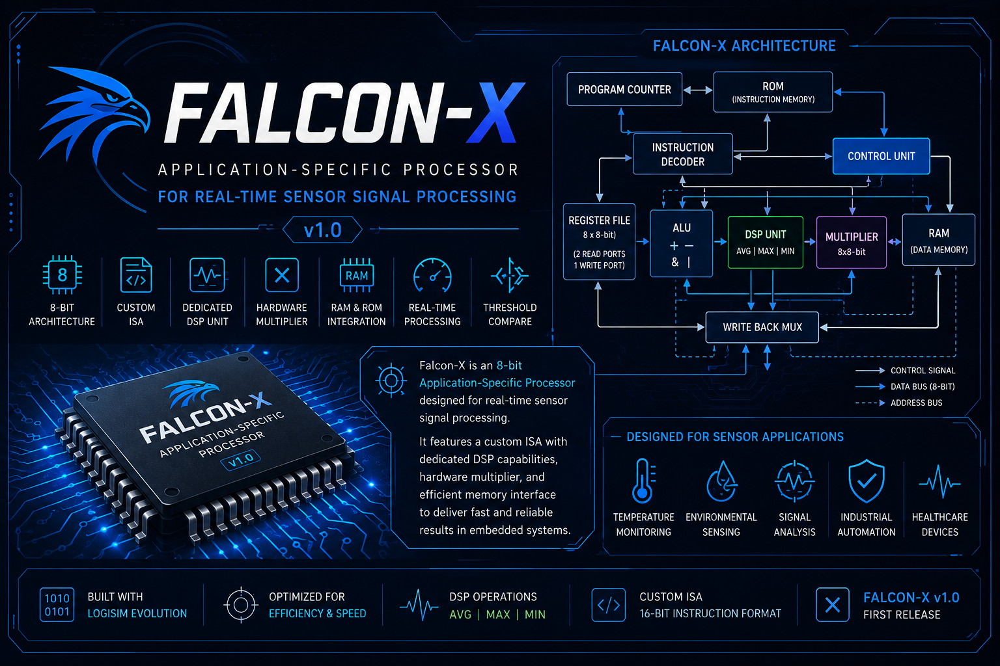

# Falcon-X Processor

<p align="center">
  
</p>

<h1 align="center">Falcon-X Processor</h1>

<p align="center">
An <strong>8-bit Application-Specific Processor (ASP)</strong> designed for <strong>real-time sensor signal processing</strong>, implemented in <strong>Logisim Evolution</strong>.
</p>

<p align="center">


</p>

---

# Table of Contents

- [Project Overview](#project-overview)
- [Engineering Problem](#engineering-problem)
- [Falcon-X Solution](#falcon-x-solution)
- [Key Features](#key-features)
- [Applications](#applications)
- [Processing Flow](#processing-flow)
- [Processor Architecture](#processor-architecture)
- [Hardware Components](#hardware-components)
- [Instruction Format](#instruction-format)
- [Instruction Set Architecture (ISA)](#instruction-set-architecture-isa)
- [Temperature Monitoring Example](#temperature-monitoring-example)
- [Project Gallery](#project-gallery)
- [Repository Structure](#repository-structure)
- [Future Improvements](#future-improvements)
- [License](#license)

---

# Project Overview

Falcon-X is an **8-bit Application-Specific Processor (ASP)** developed in **Logisim Evolution** to demonstrate how custom processor architectures can accelerate real-time sensor data processing.

Unlike a general-purpose processor that executes every task using generic arithmetic instructions, Falcon-X introduces dedicated hardware instructions specifically designed for embedded monitoring applications. By integrating Digital Signal Processing (DSP) operations directly into the processor architecture, Falcon-X reduces software complexity while improving execution efficiency for common sensor-processing tasks.

The project combines concepts from:

- Computer Architecture
- Digital Logic Design
- Embedded Systems
- Processor Design
- Digital Signal Processing (DSP)

Rather than serving as a general-purpose CPU, Falcon-X focuses on solving a specific engineering problem through specialized hardware.

---

# Engineering Problem

Modern embedded systems continuously collect data from sensors such as:

- Temperature Sensors
- Gas Sensors
- Humidity Sensors
- Light Sensors
- Industrial Monitoring Sensors

Before this data becomes useful, it typically requires several processing steps, including:

- Reading sensor values
- Calculating averages
- Detecting maximum values
- Detecting minimum values
- Comparing measurements against safety thresholds
- Storing processed results

On a traditional processor, these operations require multiple software instructions, increasing execution time and software complexity.

For embedded applications that repeatedly perform these tasks, executing them entirely in software is inefficient.

---

# Falcon-X Solution

Falcon-X addresses this challenge by implementing sensor-oriented processing directly in hardware.

Instead of treating operations such as averaging or threshold comparison as software algorithms, Falcon-X introduces dedicated processor instructions capable of performing these tasks natively.

Examples include:

- AVG
- MAX
- MIN
- THCMP

This architecture demonstrates how an **Application-Specific Processor (ASP)** can simplify embedded software while accelerating frequently executed sensor-processing operations.

Rather than optimizing for every possible workload, Falcon-X is optimized for one category of applications: **real-time sensor signal processing**.

---

# Key Features

- 8-bit Application-Specific Processor
- Custom Instruction Set Architecture (ISA)
- 16-bit Instruction Format
- Dedicated DSP Processing Unit
- Hardware Multiplier
- Register-Based Architecture
- RAM Interface
- Instruction Decoder
- Custom Control Unit
- Arithmetic Logic Unit (ALU)
- Logisim Evolution Implementation
- Modular Hardware Design

---

# Applications

Falcon-X is suitable for educational demonstrations and embedded monitoring systems where sensor values require continuous processing.

Example applications include:

- Temperature Monitoring
- Environmental Monitoring
- Smart Agriculture
- Industrial Automation
- Smart Buildings
- IoT Sensor Nodes
- Embedded Control Systems
- Digital Logic Education

Because Falcon-X performs common sensor-processing operations directly in hardware, it provides a simple demonstration of how application-specific processors can improve efficiency compared to traditional processor architectures.

---

# Processing Flow

The following diagram illustrates how Falcon-X processes sensor data from acquisition to hardware acceleration and final storage.

<p align="center">
  
</p>

### Processing Sequence

```text
Sensor
   │
   ▼
RAM Memory
   │
   ▼
Falcon-X Processor
   │
   ├── ALU Operations
   ├── DSP Operations
   └── Hardware Multiplier
   │
   ▼
Processed Result
   │
   ▼
RAM Memory
```

The processor continuously reads sensor values from memory, performs the requested computation using the appropriate hardware module, and stores the processed result back into RAM. This workflow minimizes software overhead by executing common signal-processing operations directly in hardware.

---

# Processor Architecture

The Falcon-X architecture is composed of several dedicated hardware modules working together to execute instructions efficiently.

<p align="center">
    
</p>

Each module has a dedicated responsibility within the processor pipeline, enabling a modular and organized architecture.

---

# Hardware Components

## Program Counter (PC)

<p align="center">

</p>

The Program Counter stores the address of the next instruction to be executed.

Its responsibilities include:

- Tracking program execution
- Supplying instruction addresses to Instruction ROM
- Incrementing after each instruction

The PC ensures sequential execution throughout the processor.

---

## Instruction Decoder

<p align="center">

</p>

The Instruction Decoder interprets every instruction fetched from ROM.

Its responsibilities include:

- Decoding the opcode
- Identifying source registers
- Identifying destination registers
- Extracting immediate values
- Generating control signals for the Control Unit

This module acts as the translator between machine instructions and processor hardware.

---

## Control Unit

<p align="center">

</p>

The Control Unit coordinates all processor components during instruction execution.

It determines:

- Register write operations
- RAM read/write control
- ALU operation selection
- DSP operation selection
- Multiplier activation
- Write-back source selection

Without the Control Unit, the processor components would operate independently without synchronization.

---

## Register File

<p align="center">

</p>

The Register File provides fast temporary storage for processor operations.

Features include:

- Multiple general-purpose registers
- Two read ports
- One write port
- Register-based instruction execution

Most processor instructions operate directly on register values before writing results back.

---

## Arithmetic Logic Unit (ALU)

<p align="center">

</p>

The ALU executes the processor's arithmetic and logical instructions.

Supported operations include:

- ADD
- SUB
- CMP

The ALU is responsible for general arithmetic processing required by the instruction set.

---

## DSP Unit

<p align="center">

</p>

The DSP Unit is the defining feature of Falcon-X.

Instead of implementing sensor-processing algorithms entirely in software, Falcon-X accelerates these tasks through dedicated hardware instructions.

Supported DSP operations include:

- AVG
- MAX
- MIN
- THCMP

This significantly simplifies embedded software for monitoring applications while demonstrating the concept of application-specific processor design.

---

## Hardware Multiplier

<p align="center">

</p>

Falcon-X includes a dedicated hardware multiplier to execute multiplication instructions efficiently.

Unlike software-based multiplication routines, the hardware multiplier performs multiplication directly inside the processor, reducing instruction count and execution time.

---

## RAM

<p align="center">

</p>

RAM stores both sensor values and processed results.

The processor communicates with RAM using the LOAD and STORE instructions.

Typical RAM contents may include:

- Raw sensor readings
- Intermediate values
- Final processed outputs
- Temporary variables

This memory interface enables Falcon-X to simulate real embedded monitoring systems.

---

Together, these hardware modules form a complete application-specific processor capable of acquiring, processing, and storing sensor information using a custom instruction set.

# Instruction Format

Falcon-X uses a custom **16-bit instruction format** designed for a simple register-based architecture while providing enough flexibility for arithmetic, memory, and DSP operations.

<p align="center">
    
</p>

The instruction is divided into five fields:

| Field | Description |
|-------|-------------|
| **Opcode** | Specifies the operation to execute |
| **RA** | First source register |
| **RS** | Second source register |
| **Immediate** | Constant value or memory address |
| **RD** | Destination register |

This format allows Falcon-X to support arithmetic operations, memory access, multiplication, and dedicated DSP instructions using a consistent instruction layout.

---

# Instruction Set Architecture (ISA)

Falcon-X provides a compact instruction set specifically designed for embedded sensor-processing applications.

| Instruction | Category | Description |
|------------|----------|-------------|
| **LOAD** | Memory | Load data from RAM into a register |
| **STORE** | Memory | Store register data into RAM |
| **ADD** | Arithmetic | Add two register values |
| **SUB** | Arithmetic | Subtract one register from another |
| **MUL** | Arithmetic | Hardware multiplication |
| **CMP** | Comparison | Compare two register values |
| **AVG** | DSP | Compute the average of two values |
| **MAX** | DSP | Return the larger value |
| **MIN** | DSP | Return the smaller value |
| **THCMP** | DSP | Compare a value against a predefined threshold |

The instruction set intentionally focuses on operations frequently used in sensor-monitoring systems instead of providing a large collection of general-purpose instructions.

---

# Temperature Monitoring Example

One of Falcon-X's primary design goals is accelerating sensor data processing.

Assume a temperature sensor periodically produces the following values:

| Sample | Temperature (°C) |
|---------|-----------------:|
| 1 | 27 |
| 2 | 28 |
| 3 | 30 |
| 4 | 29 |
| 5 | 31 |

Instead of implementing multiple software routines, Falcon-X executes dedicated hardware instructions.

### Average Temperature

```
AVG
```

Result:

```
29°C
```

---

### Maximum Temperature

```
MAX
```

Result:

```
31°C
```

---

### Minimum Temperature

```
MIN
```

Result:

```
27°C
```

---

### Threshold Detection

```
THCMP 30
```

Result:

```
Temperature exceeds safety threshold.
```

This example demonstrates how Falcon-X simplifies embedded software by moving common signal-processing tasks into dedicated hardware.

---

# Project Gallery

The following images present the major hardware modules used throughout the processor.

<p align="center">


<br><br>


<br><br>


<br><br>


<br><br>


</p>

These modules collectively implement the Falcon-X processor and demonstrate the interaction between the datapath, control logic, memory subsystem, and dedicated DSP hardware.

---

# Repository Structure

```text
Falcon-X-Processor
│
├── Images/
│   ├── Banner.png
│   ├── ProcessingFlow.png
│   ├── Architecture.png
│   ├── InstructionFormat.png
│   ├── MainProcessor.png
│   ├── ALU.png
│   ├── DSP.png
│   ├── RegisterFile.png
│   ├── ProgramCounter.png
│   ├── ControlUnit.png
│   ├── InstructionDecoder.png
│   ├── Multiplier.png
│   └── RAM.png
│
├── Logisim/
│   └── Falcon-X.circ
│
├── README.md
└── LICENSE
```

The repository is organized to separate documentation, images, and Logisim source files, making the project easy to explore and maintain.

---

# Future Improvements

Falcon-X was intentionally designed as a compact Application-Specific Processor focused on sensor signal processing. While the current implementation demonstrates the complete processor workflow, several enhancements could be introduced in future versions.

Possible future improvements include:

- Branch and Jump Instructions
- Interrupt Handling
- Memory-Mapped I/O
- UART Communication
- SPI and I2C Interfaces
- Timer and Counter Modules
- Pipelined Architecture
- Cache Memory
- Extended Register File
- Floating-Point Arithmetic
- Additional DSP Instructions
- FPGA Implementation
- Verilog HDL Version

These improvements would transform Falcon-X from an educational processor into a more capable embedded processing platform.

---

# Design Highlights

Falcon-X demonstrates several important computer architecture concepts within a single project.

### Processor Design

- Custom 8-bit processor architecture
- Register-based execution
- Dedicated Control Unit
- Instruction Decoder
- Program Counter
- RAM Interface

### Arithmetic Hardware

- Arithmetic Logic Unit (ALU)
- Hardware Multiplier
- Comparison Unit

### Digital Signal Processing

Unlike traditional educational processors, Falcon-X integrates dedicated DSP operations directly into the instruction set.

Supported DSP instructions include:

- AVG
- MAX
- MIN
- THCMP

These operations allow the processor to perform common sensor-processing tasks directly in hardware instead of relying on lengthy software routines.

---

# Educational Value

Falcon-X combines multiple Electrical and Computer Engineering topics into one project, including:

- Computer Architecture
- Digital Logic Design
- Processor Design
- Embedded Systems
- Memory Systems
- Instruction Set Architecture
- Digital Signal Processing
- Hardware Design Methodology

The project serves as a practical demonstration of how processor architecture can be tailored to solve a specific engineering problem rather than providing a generic computing platform.

---

# Project Summary

Falcon-X is more than an educational CPU.

It demonstrates the complete development process of an Application-Specific Processor, beginning with identifying an engineering problem and ending with a working hardware implementation.

Instead of maximizing instruction count or architectural complexity, Falcon-X focuses on efficiency for a specific workload:

- Reading sensor values
- Processing sensor data
- Performing DSP operations
- Producing processed outputs

This design philosophy reflects the principles commonly used in modern embedded systems, where specialized hardware often provides greater efficiency than general-purpose processing.

---

# License

This project is released under the MIT License.

You are welcome to use, study, modify, and extend the project for educational and personal purposes.

---

# Author

## Abdullah Almutairi

**Electrical & Computer Engineering Student**

King Abdulaziz University

---

# Acknowledgments

This project was developed as part of a personal learning journey in:

- Computer Architecture
- Embedded Systems
- Digital Logic
- Processor Design

Special thanks to the open-source community for providing valuable educational resources that supported the development of this project.

---

<p align="center">

**⭐ If you found this project interesting, consider giving it a star on GitHub.**

</p>

<p align="center">

Designed and implemented with ❤️ using Logisim Evolution.

</p>
